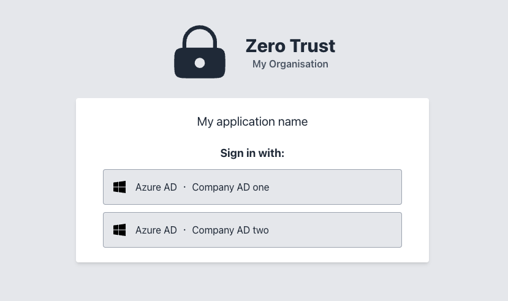
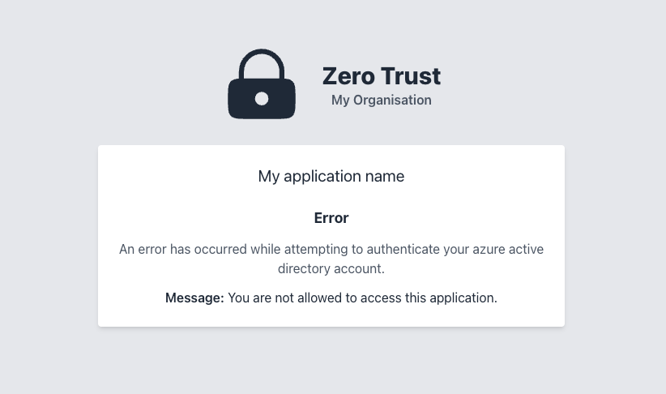

# ZeroTrust

[![Latest Version on Packagist][ico-version]][link-packagist]
[![Total Downloads][ico-downloads]][link-downloads]

Zero trust is a Laravel middleware that provides an authentication middleware wrapper for your enterprise application
using Azure active directory, allowing you to take advantage of account
restrictions and 2FA (if enabled in your AD) without having to touch your applications' authentication.

With the middleware added to your route(s), the user will be greeted with a login selection page (if more than one
directory is added) or sent directly to the Microsoft login page.



## Setting up Microsoft Azure Active Directory

To setup your Azure AD for use with this package, you can follow the following guide HERE from Microsoft.

For your callback URL, you will need to use `https://yourdomain.com/zero-trust/callback`.

## Installation

Via Composer

```bash
composer require scolmore/zerotrust
```

## Publish the configuration and views

```bash
php artisan vendor:publish --provider="Scolmore\ZeroTrust\ZeroTrustServiceProvider"
```

## Usage

### Configuration

The following will need to be added to your `.env` file:

```dotenv
ZEROTRUST_TITLE="My Organisation"
ZEROTRUST_APP_NAME="My application name"
ZEROTRUST_ENABLED=true

ZEROTRUST_AZURE_NAME="Company AD one"
ZEROTRUST_AZURE_TENANT_ID=<YOUR TENANT ID>
ZEROTRUST_AZURE_CLIENT_ID=<YOUR CLIENT APPLICATION ID>
ZEROTRUST_AZURE_SECRET=<YOUR SECRET FOR GRAPH API>
```

### Middleware

Add the middleware to the required route(s)/route groups.

```php
Route::middleware('zero-trust')->get('/dashboard', function () {
    return view('dashboard');
})->name('dashboard');
```

### Automatic login

If you want to attempt to automatically log the user in, set `ZEROTRUST_AUTO_LOGIN=true` in your `.env` file.

This will perform a lookup on the Microsoft signed-in user on your User modal against the email column, if one is found
the user will be logged in to your application.

The User modal and email column can be changed in the configuration file.

### Restricted domains

You may have a Microsoft Active Directory that has many different domains, and for your particular application, you want to restrict this.

Lets say your AD has the following domains:
- example.com
- foo.com
- bar.com

You want, foo.com and bar.com to have access, but not example.com. To do this simply add the following to you `.env` file:

```dotenv
ZEROTRUST_RESTRICTED_DOMAINS="foo.com,bar.com"
```

Now when a user from example.com tries to login, they will be refused access and be displayed with the following screen.



### Logging out

When a user logs out, you may also want to log them out of the Microsoft account at the same time. To do this, replace
your Laravel logout method that calls `route('logout')` with `route('zero-trust.logout')`.

### Extending the middleware

If you would like to perform additional actions when a user is authenticated or a restricted domain tries to login, you can extend the middleware from your own middleware.

For example, perhaps you want to log the access with the Spatie activity log.

In that case, create a new middleware, extend the ZeroTrust middleware and override the `completed` method.

`ZeroTrustMiddleware.php`
```php
<?php

namespace App\Http\Middleware;

use Scolmore\ZeroTrust\ZeroTrust;

class ZeroTrustMiddleware extends ZeroTrust
{
    public function completed(bool $success, array $user): void
    {
        // TODO: Add your logging here.
        
        // $success = true if access was granted or false if the user was refused due to restrictions.
        
        // $user is an array of the user's details from the Microsoft graph API.
    }
}

```

## Change log

Please see the [changelog](changelog.md) for more information on what has changed recently.

## Testing

```bash
composer test
```

## Security

If you discover any security related issues, please email sam@scolmore.com instead of using the issue tracker.

## Credits

- [Samuel Loft][link-author]
- [All Contributors][link-contributors]

## License

MIT. Please see the [license file](license.md) for more information.

[ico-version]: https://img.shields.io/packagist/v/scolmore/zerotrust.svg?style=flat-square

[ico-downloads]: https://img.shields.io/packagist/dt/scolmore/zerotrust.svg?style=flat-square

[link-packagist]: https://packagist.org/packages/scolmore/zerotrust

[link-downloads]: https://packagist.org/packages/scolmore/zerotrust

[link-author]: https://github.com/samloft

[link-contributors]: https://github.com/scolmore/zerotrust/contributors

[link-microsoft-setup]: https://learn.microsoft.com/en-us/power-apps/developer/data-platform/walkthrough-register-app-azure-active-directory
